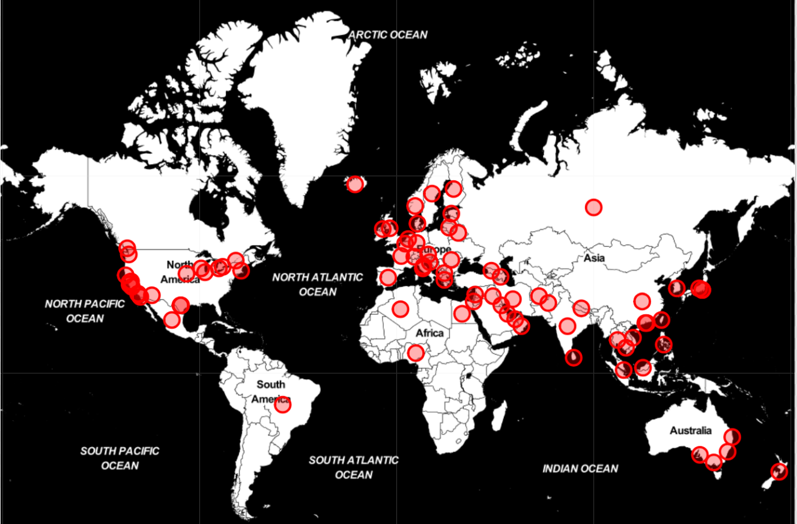
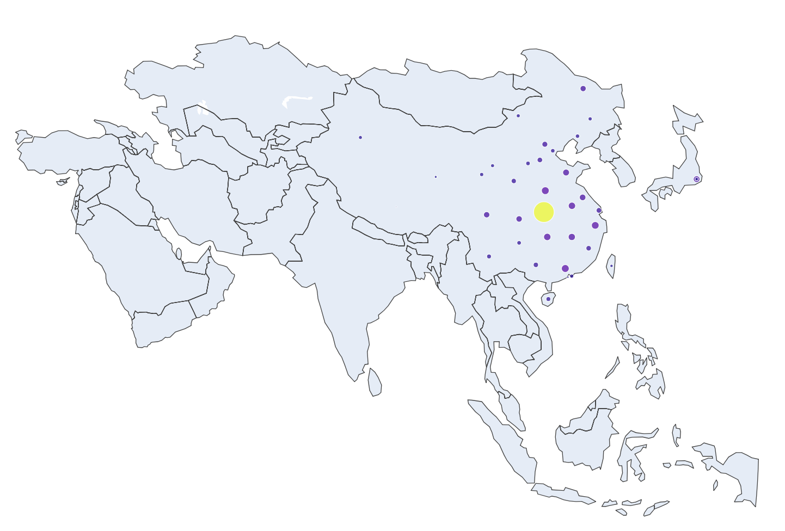

```{r setup, echo=F, purl=F}
knitr::opts_knit$set(root.dir = getwd())
knitr::opts_chunk$set(results = 'hide',eval=T)
knitr::opts_chunk$set(warning = FALSE, message=FALSE)
knitr::opts_chunk$set(out.height="0.5\\textwidth", fig.width=6, fig.height=3, fig.align="center")
```

```{r prepare, echo=F, purl=F}
rm(list=ls())
options(digits=4)
options(scipen=100)
graphics.off()
Sys.setlocale("LC_ALL", "Chinese")
```

# 数据处理及读取
```{python}
import pandas as pd
import numpy as np
```
接下来导入数据，本次使用的数据是Github上一个项目里的，也可以直接用pandas包导入，
需要注意的是不能直接使用Github那个网址，否则会报错，需要将前面部分改成
https://raw.githubusercontent.com/，
然后就是加入数据的目录地址。数据主要是是三个
文件，包含了疫情的确诊数（confirmed），治愈数（recoved），死亡数（deaths），基本
上每日会更新最新疫情数据。以下数据更新至2020年2月28日。

```{python}
path='./data/COVID-19/csse_covid_19_data/csse_covid_19_time_series/'
confirmed = pd.read_csv(path+'time_series_19-covid-Confirmed.csv')
recovered = pd.read_csv(path+'time_series_19-covid-Recovered.csv')
deaths = pd.read_csv(path+'time_series_19-covid-Deaths.csv')
```

```{python}
print(confirmed.shape)
print(recovered.shape)
print(deaths.shape)
```
```{python}
confirmed.head()
```
| Province/State | Country/Region |     Lat |     Long | 1/22/20 |  ... | 2/28/20 |
| :------------- | :------------- | :------ | :------- | :-----: | :--- | :------ |
|          Anhui | Mainland China | 31.8257 | 117.2264 |   1     |  ... |   990   |
|        Beijing | Mainland China | 40.1824 | 116.4142 |   14    |  ... |   410   |
|      Chongqing | Mainland China | 30.0572 | 107.8740 |   6     |  ... |   576   |
|         Fujian | Mainland China | 26.0789 | 117.9874 |   1     |  ... |   296   |
|          Gansu | Mainland China | 36.0611 | 103.8343 |   0     |  ... |   91    |

```{python}
recovered.head()
```
| Province/State | Country/Region |     Lat |     Long | 1/22/20 |  ... | 2/28/20 |
| :------------- | :------------- | :------ | :------- | :-----: | :--- | :------ |
|          Anhui | Mainland China | 31.8257 | 117.2264 |    0    |  ... |   821   |
|        Beijing | Mainland China | 40.1824 | 116.4142 |    0    |  ... |   257   |
|      Chongqing | Mainland China | 30.0572 | 107.8740 |    0    |  ... |   422   |
|         Fujian | Mainland China | 26.0789 | 117.9874 |    0    |  ... |   235   |
|          Gansu | Mainland China | 36.0611 | 103.8343 |    0    |  ... |   82    |
```{python}
deaths.head()
```
| Province/State | Country/Region |     Lat |     Long | 1/22/20 | ... | 2/28/20 |
| :------------- | :------------- | :------ | :------- | :-----: | :---| :-----: |
|          Anhui | Mainland China | 31.8257 | 117.2264 |    0    | ... |    6    |
|        Beijing | Mainland China | 40.1824 | 116.4142 |    0    | ... |    7    |
|      Chongqing | Mainland China | 30.0572 | 107.8740 |    0    | ... |    6    |
|         Fujian | Mainland China | 26.0789 | 117.9874 |    0    | ... |    1    |
|          Gansu | Mainland China | 36.0611 | 103.8343 |    0    | ... |    2    |


# 数据可视化
## 世界范围
```{python}
import matplotlib.pyplot as plt
plt.rcParams['font.sans-serif']=['SimHei']#用来正常显示中文标签
plt.rcParams['axes.unicode_minus']=False#用来正常显示负号
```
首先看看哪些地区发生了疫区，一共有75个地区都有肺炎疫情。
```{python}
countries = confirmed['Country/Region'].unique()
print(countries)
print(len(countries))
```
接下来看看世界疫情发展趋势，在此之前，需要计算出每日所有地区新冠肺炎的确诊人数，治愈数，死亡数。
```{python}
all_confirmed=np.sum(confirmed.iloc[:,4:])
all_recovered=np.sum(recovered.iloc[:,4:])
all_deaths=np.sum(deaths.iloc[:,4:])
all_confirmed.head()
```

接下来就可以画出疫情发展趋势图了。
```{python fig1,eval=T,fig.cap='全球疫情变化趋势',dev="pdf"}
import matplotlib.ticker as tkr
fig,ax = plt.subplots() 
ax.plot([i[:-3] for i in all_confirmed.index],all_confirmed.values,color='red',label='确诊',marker='o',markersize=2)
ax.plot([i[:-3] for i in all_confirmed.index],all_recovered.values,color='blue',label='治愈',marker='x',markersize=2)
ax.plot([i[:-3] for i in all_confirmed.index],all_deaths.values,color='lime',label='死亡',marker='*',markersize=2)
ax.xaxis.set_major_locator(tkr.MultipleLocator(2.0))
ax.xaxis.set_minor_locator(tkr.MultipleLocator(1.0))
##set the str format of major ticker of X axis
#ax.xaxis.set_major_formatter(tkr.FormatStrFormatter('%m/%d/%y'))
#ax.xaxis.set_ticklabels([i[:-3] for i in all_confirmed.index[::2]],rotation=45)
#all_confirmed.index[::2]#取出奇数位置的元素
plt.xticks(rotation=45)
plt.yticks()
ax.set(xlabel='时间',ylabel='数目')
plt.legend(loc='upper left',fontsize = 10)
plt.tight_layout()
plt.show()
```

从 \@ref(fig:fig1) 可以看出，目前新冠肺炎确诊病例还在持续增加，不过治愈人数也在持续增长，死亡率很少。

另外确诊人数在2月13日那天有较大幅度的增长。


下面看看新冠肺炎的死亡率，首先计算死亡率数据，然后再画图。
```{python fig2,eval=T,fig.cap='全球疫情死亡率',dev="pdf"}
death_rate=(all_deaths/all_confirmed)
import matplotlib.ticker as tkr
fig,ax=plt.subplots()
ax.plot([i[:-3] for i in death_rate.index],death_rate.values,color='lime',label='死亡率',marker='o',markersize=3)
ax.xaxis.set_major_locator(tkr.MultipleLocator(2.0))
ax.xaxis.set_minor_locator(tkr.MultipleLocator(1.0))
## set the str format of major ticker of X axis
#ax.xaxis.set_major_formatter(tkr.FormatStrFormatter('%m/%d'))
#ax.xaxis.set_ticklabels([i[:-3] for i in death_rate.index[::2]],rotation=45)
plt.xticks(rotation=45)
plt.yticks()
ax.set(xlabel='时间',ylabel='死亡率')
#plt.title('全球疫情死亡率',size=30)
plt.tight_layout()
plt.show()
```

## 中国大陆

由于本次疫情主要发生在中国大陆，下面来具体研究下中国大陆的疫情情况.

### 数据提取

首先从全部数据中提取出中国大陆的数据。里面包含了省份，以及每个省最新的确诊数，治愈数，死亡数。
```{python}
last_update = confirmed.columns[-1] # 设置最新数据日期
China_cases = confirmed[['Province/State',last_update]][confirmed['Country/Region'] == 'Mainland China']
China_cases['recovered'] = recovered[[last_update]][recovered['Country/Region'] == 'Mainland China']
China_cases['deaths']=deaths[[last_update]][deaths['Country/Region']=='Mainland China']
China_cases = China_cases.set_index('Province/State')
China_cases = China_cases.rename(columns = {last_update:'confirmed'})
China_cases.head()
```
|Province/State| confirmed | recovered |  deaths  | 
| :----------- | :-------- | :-------- | :------: |
|     Anhui    |    990	   |    821    | 6        | 
|   Beijing    |    410    |    357    | 7        |
|    Chongqing |    576    |     422   | 6        | 
|     Fujian   |    296    |    235    | 1        | 
|     Gansu    |     91    |    82     | 2        |

### 中国大陆各个省份确诊数，治愈数，死亡数条形图

下面画出中国大陆每个省份的疫情数量图。
```{python fig3,eval=T,fig.cap='全国各省市疫情数量',dev="pdf",out.width='95%',out.height='80%'}
#'Country/Region'
fig,ax=plt.subplots()
Mainland_China = China_cases.sort_values(by = 'confirmed',ascending = True)
Mainland_China.plot(kind = 'barh',color=['red','blue','lime'],figsize=(20,30),ax=ax)
plt.xticks(fontsize=35)
plt.yticks(fontsize=35)
ax.set_xlabel('数量',fontsize=35)
ax.set_ylabel('省/市',fontsize=35)
plt.legend(bbox_to_anchor=(0.95,0.95),fontsize = 30)
plt.tight_layout()
plt.show()
```
图\@ref(fig:fig3)显示，湖北省三项数据高居第一位，且远远高于其他省份。

### 中国大陆治愈率，死亡率折线图

下面看看中国大陆的治愈率和死亡率数据，数据使用下面的代码即可计算出来，最终结果在recovered_rate和deaths_rate里。
```{python}
confirmed_China = confirmed[confirmed['Country/Region'] == 'Mainland China'] 
#得到中国大陆每个省份每日的确诊人数
confirmed_China = np.sum(confirmed_China.iloc[:,4:])
#得到中国大陆每日共有的确诊人数
recovered_China = recovered[recovered['Country/Region'] == 'Mainland China']
#得到中国大陆每个省份每日的治愈人数
recovered_China = np.sum(recovered_China.iloc[:,4:])
#得到中国大陆每日共有的治愈人数
deaths_China = deaths[deaths['Country/Region'] == 'Mainland China']
#得到中国大陆每个省份每日的死亡人数
deaths_China = np.sum(deaths_China.iloc[:,4:])
#得到中国大陆每日共有的死亡人数
recovered_rate = (recovered_China/confirmed_China)*100
deaths_rate = (deaths_China/confirmed_China)*100
```
接下来画图，显示中国大陆每日的治愈率和死亡率。
```{python fig5,eval=T,fig.cap='中国大陆治愈率 VS 死亡率',dev="pdf"}
fig,ax=plt.subplots()
ax.plot([i[:-3] for i in deaths_rate.index],recovered_rate.values,color='blue',label='治愈率',marker='o',markersize=3)
ax.plot([i[:-3] for i in deaths_rate.index],deaths_rate.values,color='lime',label='死亡率',marker='o',markersize=3)
ax.xaxis.set_major_locator(tkr.MultipleLocator(2.0))
ax.xaxis.set_minor_locator(tkr.MultipleLocator(1.0))
## set the str format of major ticker of X axis
#ax.xaxis.set_major_formatter(tkr.FormatStrFormatter('%m/%d/%y'))
#ax.xaxis.set_ticklabels([i[:-3] for i in deaths_rate.index[::2]],rotation=45)
#plt.title('中国大陆治愈率 VS 死亡率',size=30)
ax.set(xlabel='时间',ylabel='数量')
#plt.ylabel("数量")
#plt.xlabel('时间')
plt.xticks(rotation=45)
plt.yticks()
plt.legend(loc = "upper left",fontsize = 10)
plt.tight_layout()
plt.show()
```

图\@ref(fig:fig5)显示虽然在1月25日到1月31日期间死亡率略高于治愈率，但其他时间段，治愈率远远高于死亡率。

## 除中国大陆以后世界其他地区

希望能够了解世界地区各国的疫情发展情况。

### 数据提取

首先从全部数据中提取出世界其他地区的数据。里面包含了每个地区最新的确诊数，治愈数，死亡数。

```{python}
others_cases = confirmed[['Country/Region',last_update]][confirmed['Country/Region'] != 'Mainland China']
others_cases['recovered'] = recovered[[last_update]][recovered['Country/Region'] != 'Mainland China']
others_cases['deaths'] = deaths[[last_update]][deaths['Country/Region'] != 'Mainland China']
others_cases = others_cases.set_index('Country/Region')
others_cases = others_cases.rename(columns = {last_update:'confirmed'})
others_countries = others_cases.groupby('Country/Region').sum()
#数据是按地区给的，需要用分组聚合统计每个国家的疫情数据
others_countries.head()
```
| Country/Region |     Lat   |   long    |  confirmed	| recovered |  deaths  | 
|:-------------- | :-------  | :-------- | :--------- | :-------- | :------- | 
|   Thailand     |  15.0000	 | 101.0000  |   41       |    28     |    0     |
|     Japan      |  36.0000  | 138.0000  |   228      |    22     |    4     |
|  South Korea   |  36.0000  | 128.0000  |   2337     |    22     |    13    |
|    Taiwan      |  23.7000  | 121.0000  |   34       |    6      |    1     |
|     US         |  47.6062	 | -122.3321 |    1       |     1     |    0     |

### 其他国家确诊数，治愈数，死亡数条形图

```{python fig6,eval=T,fig.cap='世界其他地区疫情数量',dev="pdf",out.width='95%',out.height='80%'}
fig,ax=plt.subplots()
others_countries.sort_values(by='confirmed',ascending=True).plot(kind='barh',figsize=(20,30),color=['red','blue','lime'],width=1,rot=2,ax=ax)
ax.set_xlabel('数量',fontsize = 35)
ax.set_ylabel('Country/Region',fontsize = 35)
plt.yticks(fontsize = 30)
plt.xticks(fontsize = 30)
plt.legend(bbox_to_anchor=(0.95,0.95),fontsize = 30)
plt.tight_layout()
plt.show()
```
```{python}
others_countries['recovered'][others_countries['recovered']==max(others_countries.recovered)]
```
others指钻石公主号游轮。
从图可以看到，韩国，意大利，伊朗，日本这些地区也有很多新冠肺炎患者。
不过伊朗的治愈人数是除中国以外最多的国家。
韩国情况最为严重，确诊人数最多，治愈人数却很少。

### 其他国家治愈率，死亡率折线图

```{python}
confirmed_others = confirmed[confirmed['Country/Region']!= 'Mainland China']
#世界其他地区每日的确诊人数
confirmed_others = np.sum(confirmed_others.iloc[:,4:])
#世界其他地区每日的确诊人数总和
recovered_others = recovered[recovered['Country/Region']!= 'Mainland China']
#世界其他地区每日的治愈人数
recovered_others = np.sum(recovered_others.iloc[:,4:])
#世界其他地区每日的治愈人数总和
deaths_others = deaths[deaths['Country/Region'] != 'Mainland China']
#世界其他地区每日的死亡人数
deaths_others = np.sum(deaths_others.iloc[:,4:])
#世界其他地区每日的死亡人数总和
recover_rate = (recovered_others/confirmed_others)*100
death_rate = (deaths_others/confirmed_others)*100
```

```{python fig8,,eval=T,fig.cap='世界其他地区治愈率 VS 死亡率',dev="pdf"}
fig,ax=plt.subplots()
ax.plot([i[:-3] for i in death_rate.index],recover_rate.values,color='blue',label='治愈率',marker='o',markersize=3)
ax.plot([i[:-3] for i in death_rate.index],death_rate.values,color='lime',label='死亡率',marker='o',markersize=3)
ax.xaxis.set_major_locator(tkr.MultipleLocator(2.0))
ax.xaxis.set_minor_locator(tkr.MultipleLocator(1.0))
## set the str format of major ticker of X axis
#ax.xaxis.set_major_formatter(tkr.FormatStrFormatter('%m/%d/%y'))
#ax.xaxis.set_ticklabels([i[:-3] for i in death_rate.index[::2]],rotation=45)
#plt.title('世界其他地区治愈率 VS 死亡率',size=30)
ax.set(ylabel='数量',xlabel='时间')
plt.xticks(rotation=45)
plt.yticks()
plt.legend(loc = "upper left",fontsize = 10)
plt.tight_layout()
plt.show()
```
如图\@ref(fig:fig8)所示，中国大陆的治愈率超过世界其他地区

# 绘制疫情地图

这里主要用到两个python包，一个是folium包，这个包也是笔者最近才发现的绘图包，类似于R语言绘图里的ggplot2，可以添加图层来定义一个Map对象，最后以几种方式将Map对象展现出来。这里有一个详细教程，感兴趣的可以看看https://python-visualization.github.io/folium/。另一个包就是plotly了，这也是一个强大的绘图包，详细教程请看这里https://plot.ly/python/plotly-express/。

## folium包绘制地图

首先是folium包绘制地图，导入folium，只需要导入包就可以了，没下载这个包的记得下载才能使用。我们在前面数据里加入中国大陆的数据，并使用武汉的经纬度。

```{python}
import folium
others = confirmed[['Country/Region','Lat','Long',last_update]][confirmed['Country/Region'] != 'Mainland China']
others['recovered'] = recovered[[last_update]][recovered['Country/Region'] != 'Mainland China']
others['death'] = deaths[[last_update]][deaths['Country/Region'] != 'Mainland China']
others_countries = others.rename(columns = {last_update:'confirmed'})
others_countries.loc['145'] = ['Mainland China',30.9756,112.2707,confirmed_China[-1],recovered_China[-1],deaths_China[-1]]
#confirmed_China[-1]是中国大陆2月28日的确诊人数,把巴基斯坦的数据更换为中国大陆数
#据。
#others_countries.to_csv('./results/othercountries.csv',index_label=False)
```


```{r tab1,results='markup', cache=F,echo=F}
library("kableExtra")
library('utils')
tab1 = read.csv('./results/othercountries.csv')
knitr::kable(tab1[1:10,], row.names =F, align = c("l",rep('c',5)), caption="各个国家疫情发展情况",
             longtable = TRUE, booktabs = TRUE, linesep  = "")%>%
             kable_styling(latex_options = c("striped", "scale_down", "repeat_header", "hold_position"),repeat_header_text = "(续)")%>%
             kable_styling(full_width = T) %>%
             column_spec(1, width = c("2.5cm"))
			 
```
然后开始正式构建地图
```{python}
world_map = folium.Map(location=[10, -20], zoom_start=2.3,tiles='Stamen Terrain')
```
上面一行是定义一个world_map对象；location的格式为[纬度,经度]；zoom_start表示初始地图的缩放尺寸，数值越大放大程度越大；tiles为地图类型，用于控制绘图调用的地图样式，默认为'OpenStreetMap'，也有一些其他的内建地图样式，如'Stamen  Terrain'、'Stamen Toner'、'Mapbox Bright'、'Mapbox Control Room'等；也可以传入'None'来绘制一个没有风格的朴素地图，或传入一个URL来使用其它的自选osm。

然后往world_map里添加其他元素，注意这里的for循环和最后的add_to是把经纬度点的信息一个一个的加进去
```{python}
for lat, lon, value, name in zip(others_countries['Lat'], others_countries['Long'], others_countries['confirmed'], others_countries['Country/Region']):
    folium.CircleMarker([lat, lon],
                            radius=10,
                            popup = ('<strong>Country</strong>: ' + str(name).capitalize() + '<br>'                                
                            '<strong>Confirmed Cases</strong>: ' + str(value) + '<br>'),                        
                            color='red',                                                
                            fill_color='red',                        
                            fill_opacity=0.3 ).add_to(world_map)
                    
world_map
world_map.save('./results/world_map.html')
import webbrowser
webbrowser.open('world_map.html')
```

```{r fig10,eval=T,echo=F,fig.cap="全球疫情分布图",dev="png",results='markup',fig.width=6}

```
图\@ref(fig:fig10)显示的是全球疫情分布图。

这里主要说下popup参数
popup：str型或folium.Popup()对象输入，用于控制标记部件的具体样式（folium内部自建了许多样式），默认为None，即不显示部件。代码使用的是自定义的网页样式，其中<strong>表示加粗，<br>表示换行，以便将各个数据显示出来。

然后再运行world_map，即可出现下面的地图样式，这是一种可交互的地图，可以随意移动缩放，鼠标点击地图上红点，即可出现地区的疫情信息。

## 用plotly绘制每日疫情扩散地图。

```{python}
import plotly.express as px
```

如果想绘制每日疫情扩散地图，还需要增加一列，里面记录了每天的日期，因此我们的数据还需要再重新整理下，这里需要用的melt函数，它将列名转换为列数据(columns name → column values)，重构DataFrame，
```{python}
confirmed = confirmed.melt(id_vars = ['Province/State','Country/Region','Lat', 'Long'],var_name='date',value_name = 'confirmed')
```
主要参数说明
id_vars:不需要被转换的列名。
value_vars:需要转换的列名，如果剩下的列全部都要转换，就不用写了。
var_name和value_name是自定义设置对应的列名。

还需要把date列转换成datetime格式的数据
```{python}
confirmed['date_dt'] = pd.to_datetime(confirmed.date, format="%m/%d/%y")
confirmed.date = confirmed.date_dt.dt.date
confirmed.rename(columns={'Country/Region': 'country', 'Province/State': 'province'}, inplace=True)
#confirmed=confirmed.to_csv('./results/confirmed.csv',index_label=False)
```

```{r tab2,results='markup',echo=F}
library("kableExtra")
library('utils')
tab2 = read.csv('./results/confirmed.csv')
knitr::kable(tab2[1:10,], row.names =F, align = c("l",rep('c',6)), caption="各个地区疫情确诊情况",
             longtable = TRUE, booktabs = TRUE, linesep  = "")%>%
             kable_styling(latex_options = c("striped", "scale_down", "repeat_header", "hold_position"),repeat_header_text = "(续)")%>%
             kable_styling(full_width = T) %>%
             column_spec(1, width = c("2.5cm"))
```
同时整理出治愈数据和死亡数据
```{python}
recovered = recovered.melt(id_vars = ['Province/State', 'Country/Region', 'Lat', 'Long'], var_name='date',value_name = 'recovered')
recovered['date_dt'] = pd.to_datetime(recovered.date, format="%m/%d/%y")
recovered.date = recovered.date_dt.dt.date
recovered.rename(columns={'Country/Region': 'country', 'Province/State': 'province'}, inplace=True)
#recovered=recovered.to_csv('./results/recovered.csv',index_label=False)
deaths = deaths.melt(id_vars = ['Province/State', 'Country/Region', 'Lat', 'Long'], var_name='date', value_name = 'deaths')
deaths['date_dt'] = pd.to_datetime(deaths.date, format="%m/%d/%y")
deaths.date = deaths.date_dt.dt.date
deaths.rename(columns={'Country/Region': 'country', 'Province/State': 'province'}, inplace=True)
#deaths=deaths.to_csv('./results/deaths.csv',index_label=False)
```
```{r tab3, eval=T,results='markup', cache=F,echo=F}
library("kableExtra")
library('utils')
tab3 = read.csv('./results/recovered.csv')
knitr::kable(tab3[1:10,], row.names =F, align = c("l",rep('c',6)), caption="各个地区疫情治愈情况",
             longtable = TRUE, booktabs = TRUE, linesep  = "")%>%
             kable_styling(latex_options = c("striped", "scale_down", "repeat_header", "hold_position"),repeat_header_text = "(续)")%>%
             kable_styling(full_width = T) %>%
             column_spec(1, width = c("2.5cm"))
```

```{r tab4, eval=T,results='markup', cache=F,echo=F}
library("kableExtra")
library('utils')
tab4 = read.csv('./results/deaths.csv')
knitr::kable(tab4[1:10,],row.names =F, align = c("l",rep('c',6)), caption="各个地区疫情死亡情况",
             longtable = TRUE, booktabs = TRUE, linesep  = "")%>%
             kable_styling(latex_options = c("striped", "scale_down", "repeat_header", "hold_position"),repeat_header_text = "(续)")%>%
             kable_styling(full_width = T) %>%
             column_spec(1, width = c("2.5cm"))
```

现在三种数据都有了，我们把它们合并在一张表里面，主要用到merge函数
```{python}
merge_on = ['province', 'country', 'date']
all_data = confirmed.merge(deaths[merge_on + ['deaths']], how='left', on=merge_on).merge(recovered[merge_on + ['recovered']], how='left', on=merge_on)
confirmed.shape,recovered.shape,deaths.shape
```


由于要演示的是疫情扩散地图，因此笔者用实心圆来表示每个地区的疫情变化，而实心圆的大小则代表了三种数据的大小，所以在我们的数据里要加一列，使用confirmed数据的二分之一次方来表示实心圆的大小。
```{python}
Coronavirus_map = all_data.groupby(['date_dt', 'province'])['confirmed', 'deaths','recovered', 'Lat', 'Long'].max().reset_index()
Coronavirus_map['size'] = Coronavirus_map.confirmed.pow(0.5)  # 创建实心圆大小
Coronavirus_map['date_dt'] = Coronavirus_map['date_dt'].dt.strftime('%Y-%m-%d')
#Coronavirusmap=Coronavirus_map.to_csv('./results/Coronavirusmap.csv',index_label=False)

```{r tab5, eval=F,results='markup', cache=F,echo=F}
library("kableExtra")
library('utils')
tab5 = read.csv('./results/Coronavirusmap.csv')
#booktabs = TRUE表示生成三线表
#longtable = TRUE表示续页
knitr::kable(tab5[1:10,],row.names =F,align = c("l",rep('c',7)), caption="各个地区疫情发展情况",
             longtable = TRUE, booktabs = TRUE, linesep  = "")%>%
             kable_styling(latex_options = c("striped", "scale_down", "repeat_header", "hold_position"),repeat_header_text = "(续)")%>%
             kable_styling(full_width = T) %>%
             column_spec(1:8, width = c('1.5cm','2cm','1.2cm','1cm','1.1cm',rep('1cm',3)))

```

最后就是绘图部分，代码也很简单，如果有不懂得参数可以使用help(px.scatter_geo)来查看每个参数用法
```{python}
fig = px.scatter_geo(Coronavirus_map, lat='Lat', lon='Long', scope='asia',
                     color="size", size='size', hover_name='province',
                     hover_data=['confirmed', 'deaths', 'recovered'],
                     projection="natural earth",animation_frame="date_dt",title='亚洲地区疫情扩散图')
fig.update(layout_coloraxis_showscale=False)
#fig.show()
```

```{r fig11,eval=T,results = 'hide', echo=F,fig.cap="亚洲地区疫情扩散图",dev="png",results='markup', cache=F}

```
图\@ref(fig:fig11)显示的是亚洲地区疫情扩散图。